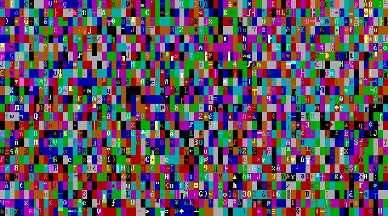
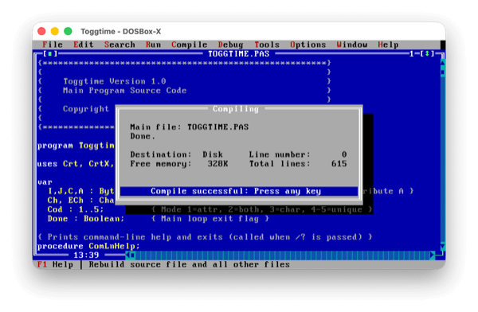
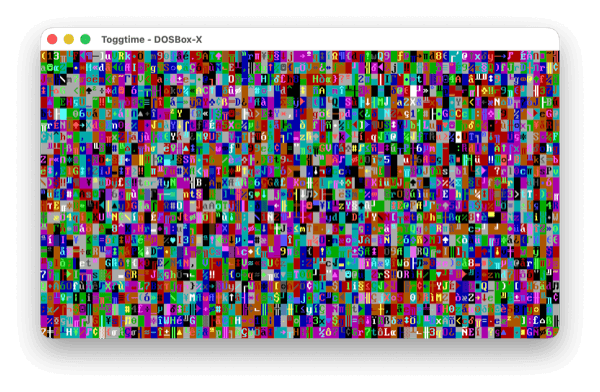

# Toggtime


A small DOS demo that animates the text-mode video memory at $B800 by toggling characters and color attributes at random screen positions.

<p align="center">
  
</p>

I wrote Toggtime in October 1995 in Borland Turbo Pascal 7, on an MS-DOS PC, as a Hello World experiment in direct video memory writes. Thirty years later, in April 2026, I dug the source out, brought it back to life, and got it to compile and run again in DOSBox-X on a modern Mac. It still works.

## What it does

When you launch Toggtime, it starts filling the screen with random characters and color attributes. You can change the mode with single keystrokes:

| Key | Effect |
|---|---|
| A | Toggle attributes only |
| B | Both attributes and characters (default) |
| C | Toggle characters only |
| U | Unique attributes and characters |
| P | Pause |
| H, Esc | Show or hide the help screen |
| Q | Quit |

## Building and running

I build and run Toggtime using [DOSBox-X](https://dosbox-x.com/) on macOS, with a copy of [Borland Turbo Pascal 7.0](https://winworldpc.com/product/turbo-pascal/7x) downloaded from WinWorld:

1. Mount the project directory and the Turbo Pascal installation in DOSBox-X
2. Launch `TURBO.EXE` and set **Options > Directories** to point at the `UNITS\` path
3. Open `SRC\TOGGTIME.PAS`
4. Press **F9** to compile, **Ctrl+F9** to run

What surprised me was how familiar it all felt. Turbo Pascal was one of the first IDEs I ever worked in — along with QBasic and Turbo C++ — when I was learning to program for the first time. And here it is again: the same blue editor, the same compilation dialog, running inside a macOS window with traffic-light buttons. A different frame around a very familiar experience.

<table>
  <tr>
    <td align="center">
      
      <br><em>Compiling in Turbo Pascal 7</em>
    </td>
    <td align="center">
      
      <br><em>Running on macOS via DOSBox-X</em>
    </td>
  </tr>
</table>

## Project layout

```
SRC/
  TOGGTIME.PAS    main program
UNITS/
  STDCHAR.PAS     character types and digit/hex constants
  CURSOR.PAS      BIOS INT 10h cursor + keyboard typematic rate
  CRTKEYB.PAS     keyboard input with extended-key handling
  CRTX.PAS        Crt extensions: attributes, windows, frames, sound
  VIAT.PAS        direct VRAM arrays mapped via the absolute keyword
```

The five units are small and reusable on their own. They may eventually move into a shared Hello World Writer Pascal library.

## License

Toggtime is licensed under the [MIT License](LICENSE).

---

Made with ❤️ in Oradea, Romania
[https://www.thehelloworldwriter.com](https://www.thehelloworldwriter.com)
